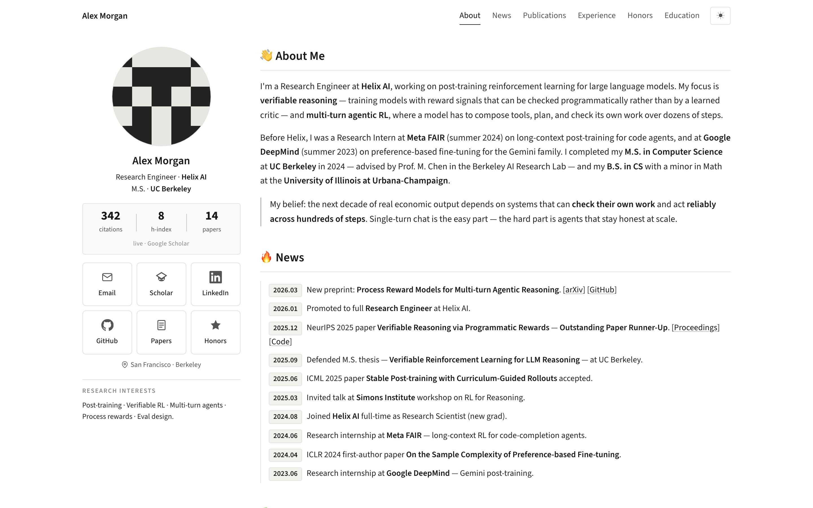
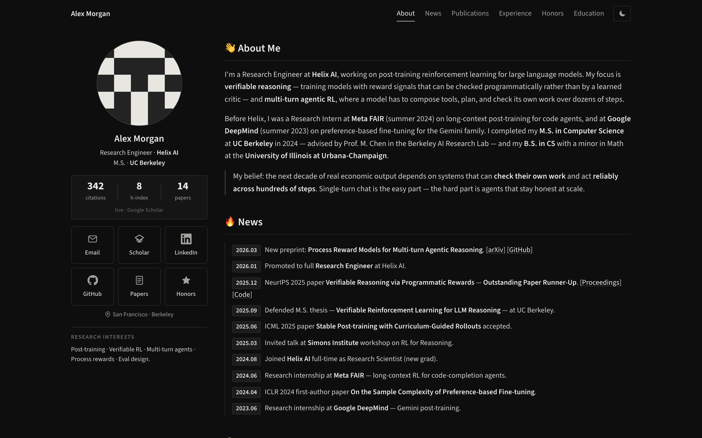
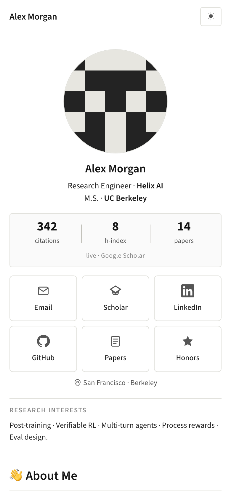

<p align="center">
  <sub><b>·&nbsp; A&nbsp;CLAUDE&nbsp;CODE&nbsp;SKILL &nbsp;·</b></sub>
</p>

<h1 align="center">Personal Website Claude Skill</h1>

<p align="center">
  <b>A Claude Code skill for young professionals — researchers and engineers alike — who need a site that makes them findable.</b><br/>
  Built from your LinkedIn, your GitHub, and (if you have one) your Google Scholar.<br/>
  Static. Monochrome. Deployed to GitHub Pages. No build step, no framework.
</p>

<p align="center">
  <a href="LICENSE"></a>
  &nbsp;
  <a href="https://claude.com/claude-code"></a>
  &nbsp;
  <a href="docs/INSTALL.md#compatibility"></a>
  &nbsp;
  <a href="https://github.com/gpz12138/personal-website-claude-skill/stargazers"></a>
  &nbsp;
  
</p>

<p align="center">
  
</p>

<p align="center"><sub>The demo above is a <a href="examples/demo-site/">fabricated example</a> — not a real researcher. Alex Morgan, the identicon avatar, the 342 citations, the NeurIPS runner-up — all invented. Your version will look different because your record is different.</sub></p>

<p align="center">
  <a href="#-install-10-seconds"><b>Install</b></a>
  &nbsp;·&nbsp;
  <a href="#-then-say"><b>Use</b></a>
  &nbsp;·&nbsp;
  <a href="#-what-it-produces"><b>What&nbsp;it&nbsp;produces</b></a>
  &nbsp;·&nbsp;
  <a href="#-what-i-baked-in"><b>Opinions</b></a>
  &nbsp;·&nbsp;
  <a href="#%EF%B8%8F-example"><b>Example</b></a>
  &nbsp;·&nbsp;
  <a href="#-faq"><b>FAQ</b></a>
</p>

---

## Why I made this

For a young researcher or engineer today, a personal homepage is close to required. It's where a hiring manager, a recruiter, a PI, or a program chair decides — in about thirty seconds — whether to read your paper, open your side project, forward your CV, or book an interview.

When I was applying to schools, a senior I trusted mentioned — in passing — that I'd need a personal site before sending anything out. I tried a couple of existing site builders, and tried hand-writing HTML from scratch. None of it came together fast enough during an application cycle where every day mattered.

So I wrote this skill — the thing I wish had existed for that version of me. You give it three URLs; it drafts the site, deploys to GitHub Pages, reviews itself, and hands back the link. Free, MIT, open source.

Hoping it saves somebody else that week.

## Who it's for

I wrote this thinking mostly about **young professionals** — PhD applicants, postdocs, and visiting students on the academic side; new grads going into SWE / ML / data / PM roles, return-offer candidates, and mid-career engineers changing companies on the industry side. The market is hard right now across both tracks. Cycles close earlier every year, referrals have replaced cold applications, and every group chat has someone exhausted, refreshing their inbox at midnight, comparing themselves to whoever's Twitter looks like they already made it. I'm one of those people too.

What actually moves the needle in a crowded market is **being findable**. When a recruiter, a hiring manager, a program chair, or a potential advisor searches your name, the first thing they land on frames you before any interview does. A clean, current homepage is a small-but-real signal: *this person is active, thoughtful, and serious about their work.*

I don't want **cost** or **front-end taste** to be the reason any of us skips that step. Squarespace is $144/year. al-folio takes a weekend you don't have. Design sense isn't distributed evenly, and neither is time. So I wrote the skill I wished existed when I started my own page, and I'm open-sourcing it for free, MIT, no strings.

If you're applying anywhere this cycle — grad school, full-time roles, internships, return offers, a visa-sponsored switch — use it. Ship something imperfect and iterate. Being seen matters more than being perfect, and both matter more than being invisible. You already did the hard part; this is the five-minute part.

## ⚡ Install (10 seconds)

**Path 1 — Terminal CLI (recommended, zero session-cache issues):**

```bash
claude plugin marketplace add GPZ12138/personal-website-claude-skill
claude plugin install personal-website-claude-skill
```

Run these in a **regular terminal**, not inside a running Claude Code session. This is the fastest and most reliable path — the plugin registers globally (user scope) and every future Claude Code session on this machine will see it.

**Path 2 — Inside a Claude Code session:**

```
/plugin marketplace add GPZ12138/personal-website-claude-skill
```

Then **restart the Claude Code session** (`exit`, then `claude` again) before running:

```
/plugin install personal-website-claude-skill
```

The restart is required because Claude Code's in-session plugin index is populated at startup — running `/plugin install` right after `/plugin marketplace add` in the *same* session can fail with *"Plugin not found in any marketplace"* even though the marketplace was just added successfully. This is a session-cache quirk, not a manifest problem.

**Path 3 — `install.sh` (user-global skill, no plugin system):**

```bash
curl -fsSL https://raw.githubusercontent.com/GPZ12138/personal-website-claude-skill/main/install.sh | bash
```

Symlinks the skill directly into `~/.claude/skills/`. Works without the plugin / marketplace layer.

**Path 4 — manual clone + symlink:** see [`docs/INSTALL.md`](docs/INSTALL.md).

## 💬 Then say

Open Claude Code in an empty folder and type something like:

> *"Build me a personal homepage. I'm an ML engineer / researcher / new grad / PhD applicant — whatever fits.*
> *LinkedIn: `<your-linkedin-url>`*
> *GitHub: `<your-github-username>`*
> *Scholar: `<your-scholar-url>` (skip if you don't have one)"*

The skill asks for anything missing, proposes a section-by-section plan, and — once you confirm — runs end-to-end (fetch → draft → deploy → review → redeploy) without interrupting. A typical run is 8–20 minutes depending on how much the reviewer agent flags.

If you'd rather not have Claude Code guess, attach a resume PDF too. It helps with dates, GPA, publication metadata.

## 📦 What it produces

- **Static single-page site** — `index.html`, `styles.css`, `script.js`, `assets/`. Nothing else.
- **Two-column layout** — sticky sidebar (photo, name, citation stats, contact grid) and a main column with About, News, Publications, Experience, Honors, Education, Skills, Contact.
- **Live Google Scholar widget** — citation count, h-index, per-year chart, updated daily by a polite two-tier poll (a lightweight check that only triggers the full scrape when a number actually changed).
- **Bilingual toggle** — English by default, plus a second language *auto-picked from whatever language you're chatting with the skill in* (Chinese, Japanese, Korean, Spanish, French, German, …). Not hardcoded to any one pairing. Off by default; opt in during clarification.
- **Light / dark theme** — respects `prefers-color-scheme`, persists via `localStorage`.
- **Mobile-responsive** — two-column collapses at `<960px`, nav hides on phones, safe-area insets on iOS, 40×40px minimum touch targets, `prefers-reduced-motion` honored.
- **A GitHub Actions workflow** that runs the Scholar sync daily, at a non-round minute to avoid the hourly rate-limit peak.
- **Deployed to GitHub Pages** at `<your-username>.github.io` — zero build step, free for public repos.

## 🧭 What I baked in

These are opinions, not laws. The skill leans on them by default; you can override any of them at the start (*"I want italics"*, *"I want a blue accent"*, etc.) and it'll build it your way — usually with a one-line note about why the default exists, so you can reconsider or stick with your call.

### Visual taste

1. **No italics.** `em { font-style: normal; }` globally. I find them hard to read at small sizes; emphasis is weight, not slant.
2. **One font.** Source Sans 3 only. No serif headings, no monospace "metric" font, no display secondary. Numeric cells get `font-variant-numeric: tabular-nums` so columns line up — that's a CSS hint, not a separate code font.
3. **One shade of gray, seven steps.** From `#ffffff` to `#161616`. No accent color. The only color on the page comes from the headshot — and that's why the headshot pops naturally without arXiv red anywhere else.
4. **Emoji on `<h2>` section headings only.** One per heading, max. Zero in body copy, publication titles, news items, honors bullets. Total page budget is roughly nine — pick from the academic set (👋 🔥 📚 💼 🏆 🎓 🛠 🌿 📮), not status-light glyphs.
5. **Light-gray venue pills** with a 1px border, never solid black. A black pill with white text on a white page reads as mourning.
6. **Components are tokenized — change one, change all.** Every repeated shape (venue pill, news card, contact tile, stats box, incoming-role box, publication row) pulls from the same CSS variables. Two boxes side-by-side use byte-identical bg / border / radius / padding / shadow. Readers pattern-match on shape; mismatched repeats read sloppy even when content is good.

### Modes & device support

7. **Bilingual with parity, and the second language is yours.** If you opt into bilingual, the second language is **whatever you've been chatting with the skill in** — Chinese, Japanese, Korean, Spanish, French, German, Portuguese — auto-detected from your messages, not hardcoded to any one pairing. Every translatable node carries both `data-en` and `data-<code>` attributes (ISO 639-1: `zh` / `ja` / `es` / `fr` / `ko` / …), and the default visible HTML byte-matches `data-en` so search-engine crawlers and pre-JS readers see the same page as everyone else. The English page stays pure English (the only exception is a parenthesized professional term with no English equivalent — Romanized when possible). The second-language page uses its own native punctuation conventions (full-width `：，。` for CJK, non-breaking space before `:` `;` `?` `!` in French, opening `¿` `¡` in Spanish, etc.) and is allowed to keep canonical English technical terms (model names, paper titles, method names).
8. **Dark mode is first-class, not an afterthought.** First load follows `prefers-color-scheme`; the toggle then persists in `localStorage`. Both palettes get a real seven-step grayscale designed for the mode — not a quick filter inversion. The headshot stays in color; the hierarchy stays the same; only the gray tokens swap.
9. **Built for every device class.** Two-column grid collapses to single column at `< 960px`; below `720px` the top nav hides because the section headings *are* the navigation. Safe-area insets respected on iOS notch / home indicator. Every interactive element ≥ 40 × 40 px at phone size. Hover styles guarded by `@media (hover: hover)` so they don't stick on touch screens. Headshot is `object-fit: cover` (never stretched), exported at 2× for retina, with `width` / `height` HTML attrs to prevent layout shift. `prefers-reduced-motion` disables every transition and reveal animation.

### Content discipline

10. **Bold what a reader recognizes.** Top-tier institutions, well-known project / paper names. Not every collaborator. Not every internal codename. Not generic titles like `intern` or `researcher`.
11. **First-author `★` only where you're first author.** No `equal contribution` asterisk inflation; if every paper has a star, the star means nothing.
12. **Union of sources, never silent drops.** If LinkedIn, Scholar, CV, or an existing site mentions an item, it goes in. Conflicts resolve to the more specific or more recent value. Single-source items get batched into a wrap-up message at the end so you can drop any you don't want — never silently filtered mid-build.
13. **Public numbers only (default).** Internal benchmark scores, pre-release model names, non-public grant sizes stay vague unless you explicitly override. The aesthetic is *covert confidence* — specific where the source is public, deliberately vague where it isn't.
14. **Honest layout — empty sections omitted, not padded.** No publications? Section disappears. Skipped Scholar? The widget vanishes. No teaching? No teaching section. Better to ship a short, true page than a long, padded one that fades into LinkedIn-template texture.

### Behavior & process

15. **Live Scholar widget that won't get you CAPTCHA'd.** Two-tier polite poll runs daily at a non-round minute (`17 3 * * *`) to dodge the top-of-hour bot peak. A lightweight HTML scrape reads one number first; only on change does it trigger the heavy full scrape via `scholarly`. On any error, the previous snapshot is preserved — your page never flickers to zero.
16. **Two-agent review, minimum three rounds.** A generator agent ships v1. A reviewer agent opens the deployed URL and scores against a 30-item rubric (palette / tone / markup / data integrity / responsiveness / deployment correctness). Flags become fixes, fixes redeploy, redeploy gets re-reviewed — until the rubric clears, then twice more.

Full rationale for each rule — and ~50 more pre-ship checklist items I didn't surface here — lives in [`skills/personal-website-claude-skill/SKILL.md`](skills/personal-website-claude-skill/SKILL.md). That file is the spec; the rules aren't arbitrary, but they are opinionated.

## 🖼️ Example

<p align="center">
  <a href="examples/demo-site/">
    
  </a>
</p>

<p align="center"><a href="examples/demo-site/"><b>→ examples/demo-site/</b></a> — a <b>fabricated</b> LLM-RL researcher named Alex Morgan. The avatar is a monochrome identicon; the publications, honors, and benchmarks are invented to illustrate what the skill's output looks like when all the source fields are populated.</p>

<table>
<tr>
<td align="center"><br/><sub>Desktop · dark</sub></td>
<td align="center"><br/><sub>Mobile · portrait</sub></td>
</tr>
</table>

Whether the layout, density, and defaults work for <b>your</b> record is a judgment call only you can make — if something doesn't fit, the files are 1,500 lines of readable HTML/CSS/JS and you can edit them directly after the skill is done.

A note on survivorship bias: the demo's numbers (342 citations, NeurIPS runner-up, Meta FAIR + DeepMind internships) make the page look full. A first-year PhD or a career-changer with fewer public artifacts will get a sparser layout — the skill omits empty sections rather than padding them, so the output honestly reflects the input.

## ✅ Requirements

- **Claude Code** (recent version). [Install](https://claude.com/claude-code).
- **A GitHub account.** Free, public repos. The site deploys to `<your-username>.github.io`.
- **A LinkedIn URL**, publicly viewable. LinkedIn often blocks automated fetches — the skill has a four-tier fallback; worst case it asks you to paste the relevant sections.
- **A Google Scholar profile** — *optional*. Add it and you get the live citation widget. Skip it and the widget disappears; everything else still works.
- **Optional but recommended: a resume PDF.** LinkedIn alone misses some dates, GPA, ranks, publication metadata, and project specifics.

## ❓ FAQ

**Is this free?** Yes. MIT license. GitHub Pages is free for public repos. Claude Code is the only paid piece and you're presumably already paying for it.

**Does it only work for AI / ML researchers?** No. The skill's default sections (About, News, Experience, Education, Skills, Projects, Contact) are track-neutral — SWEs, ML engineers, data scientists, designers-who-code, PMs with a technical background can all drop straight in. The two research-specific bits are optional: **Publications** gets omitted if you don't have any, and the **Scholar widget** disappears if you skip the Scholar URL. Adapt *Skills* and *Research Interests → Focus areas* to your field.

**I don't have a Google Scholar profile — can I still use this?** Yes. Skip it when the skill asks; the sidebar citation box and the per-year chart simply don't render. Everything else — layout, News, Experience, Skills, theme toggle, mobile responsiveness — works exactly the same.

**Can I change the palette?** Tell the skill in the first message. The default monochrome exists because it's a safe starting point, not because it's the only right answer.

**What if LinkedIn blocks the fetch?** Expected. The fallback is plain HTTP → browser User-Agent → Playwright headless → asking you to paste. It never fakes a page from your name alone.

**What if I already have a homepage?** Give the skill the existing URL as a fourth source. It extracts facts (bio, news, publications, honors) and ignores the design.

**Can I update the site later?** Yes — run the skill again in the same repo and tell it what changed. Scholar stats update themselves daily via the installed workflow.

**Does it work on a project page (`<username>.github.io/<repo>`)?** Yes. User pages just get a cleaner URL.

**Is the design really "AI-generated looking"?** Subjective — look at the [demo site](examples/demo-site/) and decide for yourself. The skill's two-agent reviewer loop catches a lot of the usual giveaways (stretched headshots, arXiv red, off-palette colors, bilingual-parity gaps), but it isn't a substitute for a human pass. Expect to spend 15 minutes tweaking copy after the skill finishes.

## 🤝 Contributing

See [`CONTRIBUTING.md`](CONTRIBUTING.md). Rule-change PRs should explain *why* the existing rule is wrong — a lot of them look arbitrary until you've rebuilt a page three times.

## Author

Built and maintained by **Peizhong (Chill) Gao** — [gpz12138.github.io](https://gpz12138.github.io).

## License

MIT. See [`LICENSE`](LICENSE).
